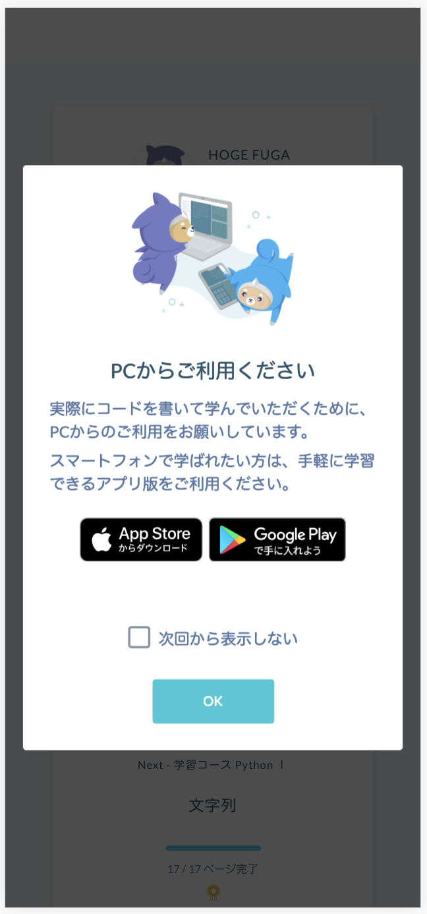
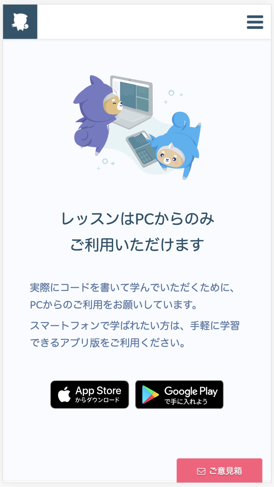

# 職務経歴書

## 基本情報

|key|value|
|:-:|:---:|
|Name|日下部 達哉 (Tatsuya Kusakabe)|
|Email|t.kskb.boyohnbounce@gmail.com|
|LinkedIn|[こちら](https://www.linkedin.com/in/tatsuya-kusakabe-a5188b96/)|

## 資格

|資格|取得月|
|:-:|:---:|
|基本情報処理技術者|2019.05|
|LPIC Level 1|2019.06|

## スキル

### 自然言語

|言語|レベル|
|:-:|:---:|
|日本語|ネイティブ|
|英語|ビジネス (TOEIC: 970)|

### プログラミング言語・フレームワーク

|フレームワーク (言語)|使用時期|
|:----------------:|:-----:|
|Ruby on Rails (Ruby)|2018.11 ~ 2019.03|
|React, Flux (JavaScript)|2018.11 ~ 2019.03|
|React, Flux (TypeScript)|2019.03 ~ 2019.05|
|Express, Passport (TypeScript)|2019.03 ~ 2019.05|
|Webpack (JavaScript)|2019.03 ~ 2019.05|

### その他

- GIS (学部時代の研究で使用)
  - 下水熱の分配を、地域内で全体最適となるように行うモデルを構築
  - 福岡市街地の下水管路・土地利用データに対してモデルを適用し、効果を実証

## 職務経歴 (progate)

### 勤務先概要
|key|value|
|:--|:----|
|会社名|株式会社 Progate|
|資本金|8210万円|
|社員数|25名前後|
|業種|ソフトウェア・情報処理|
|開発環境|HAML, SCSS, React, Flux, Rails, CircleCI, AWS|

### 職務概要
|key|value|
|:--|:----|
|経験期間|2019年1月 ~ 2019年3月|
|経験職種|プログラマー (React, Flux, Rails)|
|雇用形態|正社員 (お試し)|
|年収実績|420万円|

### 印象に残った職務
スマホ専用のモーダルとページの実装

#### 背景
- スマホブラウザでログインや新規登録をしたユーザーが、演習画面で多く離脱していた。
- 会社として、「パソコンでの演習」と「スマホアプリでの予習・復習」を推奨しており、  
スマホブラウザでのユーザ体験が悪いことが原因、と仮説を立てた。
- そこで、スマホブラウザからのアクセスがあった場合、  
パソコンかスマホアプリに誘導するモーダルとページを作成した。

#### 具体的な実装（モーダル）
- Rails で、ユーザーエージェントとリダイレクト元を読み取り、  
「ログインページか新規登録ページから」「スマホで」「ランディングページにアクセスしたか」を把握する。
- React で、「パソコンかスマホアプリで演習しましょう」というモーダルを作成する。
- Rails での表示条件を満たした場合、HAML に id 付きの空要素を埋め込む。
- HAML の空要素があった場合、作成したモーダルで空要素をデコレートする。
- モーダルに「次回から表示しない」チェックボックスをつけ、  
クリックされたら localStorage に情報をキャッシュする。

#### 具体的な実装（ページ）
- Rails で、ユーザーエージェントを読み取り、「スマホで」「演習ページにアクセスしたか」を把握する。
- HAML で、「パソコンかスマホアプリで演習してください」というページを作成する。
- Rails での表示条件を満たした場合、HAML で作成したページへリダイレクトする。

#### 学んだこと
- デザイナーとのコミュニケーション  
  - ユーザーが progate を知って最初に目にするページになるので、デザイナーの思い入れが強かった。  
  - 「デザイナーとの調整〜実装」のプロセスを何度も繰り返し、デザイナーからの信頼を得られた。  
- スピードと可読性のバランス  
  - 最初のうちは可読性を気にしすぎ、既存のコードのリファクタにまで手をつけた。  
  - 結果、プルリクが遅れてチームの皆さんに迷惑をかけた。  
  - 終盤は、必要とされる仕様に対して「どの程度のスピード」「どの程度の可読性」が必要かを考えた。
  - 結果、リードエンジニアから「プルリクの出し方がかなり上手くなった」との評価を得られた。
